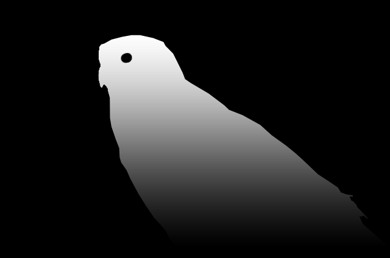
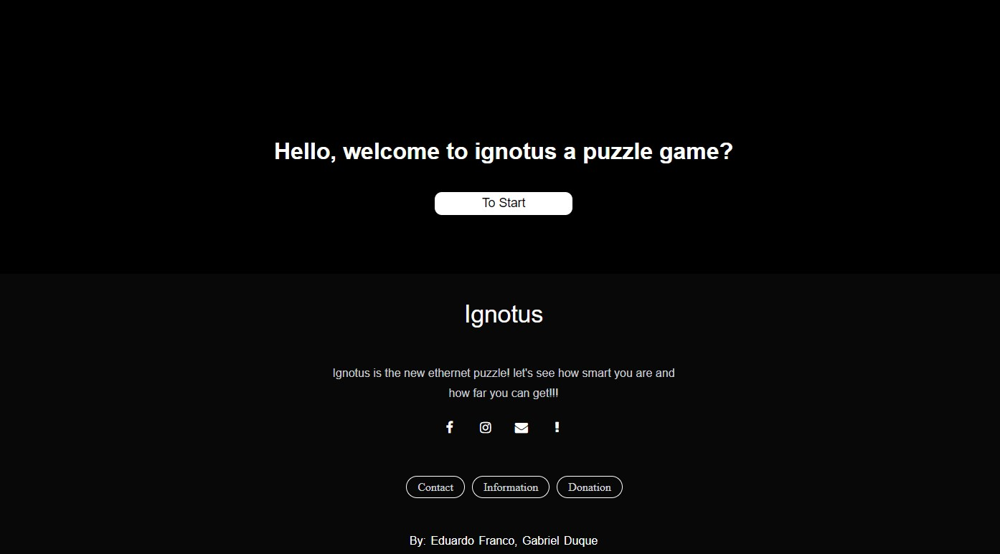
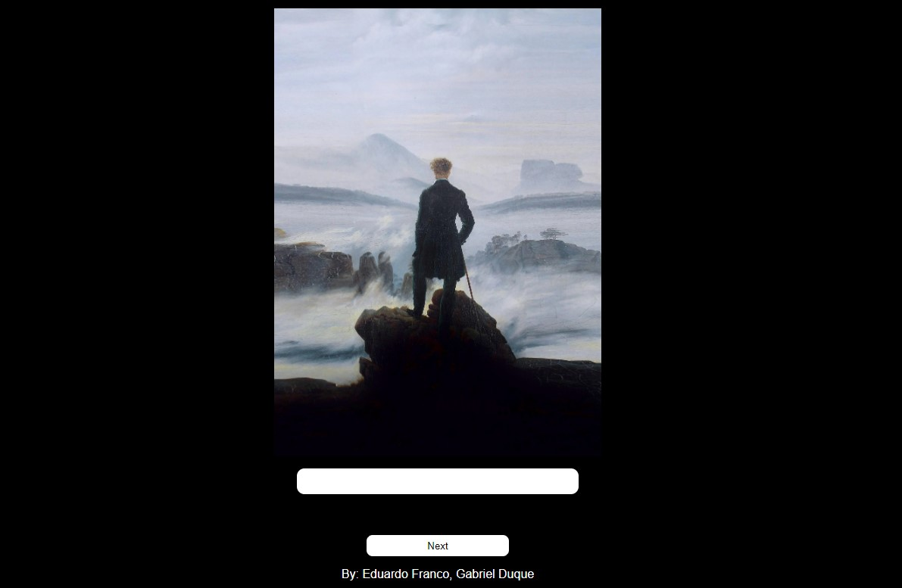

 

  # IGNOTUS

# Web Site de Enigma 
Olá, Meu nome é Eduardo este repositório é um projeto iniciado em agosto de 2022, o qual não foi terminado. O projeto foi criado por mim e meu amigo Gabriel Duque. 

# O que é o projeto?
 O projeto se trata de um web site de enigmas aonde o usuário dera desvendar os enigmas de casa pagina do site para avançar na sua jornada. O projeto atual tem 12 fases sendo um enigma com dificuldade elevada, aonde o usuário passara meses para desvendar uma única fase!.
 Então você topa o desafio de tentar ? mais duvido que consignam terminar..  
 
Infelizmente o projeto não será finalizado por isso não está hospedado para todos acessar, o coloquei aqui para demonstrá-lo.
 
 

   <h1>Abaixo algumas imagens do projeto</h1>
   
   
   
  
   
   

 

 
  Aqui são umas das linguagens de progamação que estão sendo utilizadas para desenvolver o projeto
 

  
  
  
  
  
            

 

  
 

